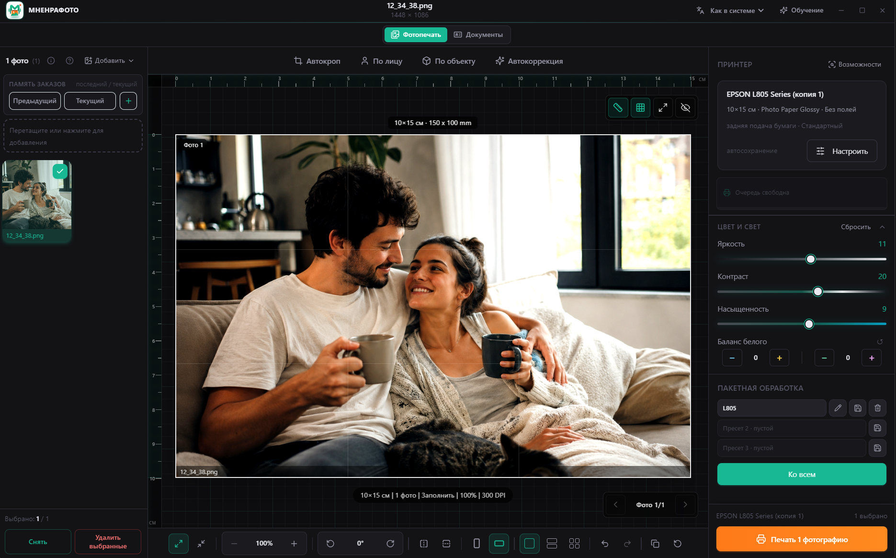
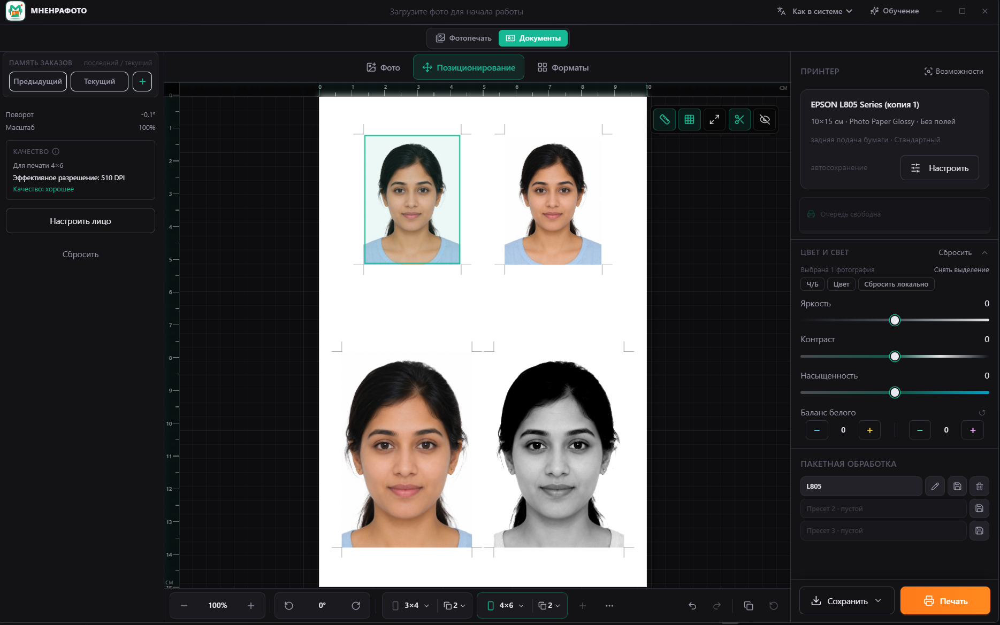

# МНЕНРАФОТО

Бесплатная Windows-программа для быстрой подготовки и печати фотографий.

> **Текущая версия:** 0.2.0 Alpha 2<br>
> **Статус:** публичное тестирование<br>
> **Платформа:** Windows 10/11, 64-bit

[English version](README_EN.md)

[](https://github.com/mnenracom/mnenrafoto-releases/releases/download/v0.2.0-alpha.2/MnenraFoto-0.2.0-alpha.2-win-x64-setup.exe)
[](https://github.com/mnenracom/mnenrafoto-releases/releases/download/v0.2.0-alpha.2/MnenraFoto-0.2.0-alpha.2-win-x64-portable.exe)
[](https://github.com/mnenracom/mnenrafoto-releases/releases/tag/v0.2.0-alpha.2)
[](https://github.com/mnenracom/mnenrafoto-releases/releases/download/v0.2.0-alpha.2/SHA256SUMS.txt)

[Сайт RU](https://mnenrafoto.ru/program) · [Website EN](https://mnenrafoto.ru/en/program) · [Boosty](https://boosty.to/mnenra) · [Сообщить об ошибке](https://github.com/mnenracom/mnenrafoto-releases/issues/new/choose)



## Скриншоты Alpha 2

| Фотопечать | Фото на документы |
| --- | --- |
|  |  |

## Что это

МНЕНРАФОТО — локальная Windows-программа для быстрого импорта, подготовки, обработки и печати фотографий.

Главный практический смысл:

- быстро загрузить большое количество фотографий;
- подготовить их к печати;
- применить настройки ко всему заказу;
- сохранить пресеты;
- переключаться между текущим и предыдущим заказом;
- печатать обычные фотографии и фото на документы;
- не загружать изображения в облако.

## Новое в Alpha 2

### Фото на документы

- отдельный режим «Фото на документы»;
- форматы 3×4, 3,5×4,5 и 4×6;
- смешанные листы;
- уголки и линии реза;
- пользовательские форматы;
- позиционирование лица;
- настройка отдельных копий;
- цветные и чёрно-белые фотографии на одном листе;
- сохранение для Госуслуг;
- сохранение готового листа JPEG;
- тираж одинаковых листов;
- оценка эффективного разрешения.

### Рабочий процесс

- счётчик активной фотографии `N из M`;
- кнопка «Новый заказ»;
- сохранение текущего заказа в «Предыдущий» без перезапуска;
- сохранение пользовательских пресетов;
- обновлённый компактный баланс белого;
- Undo/Redo.

### Печать и бумага

- новые метрические и международные форматы;
- отдельные физические форматы 15×20 и 15×21;
- улучшенное определение форматов драйвера;
- physical-first paper matching;
- улучшения PrintTicket;
- исправления Epson L805, L1210 и L1250;
- честный прогресс подготовки и передачи задания в очередь Windows.

Результат физической печати зависит от конкретного принтера, драйвера, бумаги и настроек Windows.

## Что умеет Alpha 2

- импорт файлов и папок;
- JPG/JPEG/PNG/WebP/HEIC/HEIF;
- пакетная обработка;
- обработка отдельных фотографий;
- яркость, контраст, насыщенность и баланс белого;
- crop, zoom, pan;
- поворот, отражение и выравнивание;
- раскладки фотографий;
- пользовательские пресеты;
- применение настроек ко всему заказу;
- текущий и предыдущий заказ;
- новый заказ без перезапуска;
- фотопечать;
- фото на документы;
- экспорт JPEG;
- экспорт для Госуслуг;
- RU/EN интерфейс.

## Как начать

1. Скачайте **Setup**.
2. Установите программу.
3. Выберите принтер и формат бумаги.
4. Загрузите фотографии.
5. При необходимости скорректируйте цвет и кадрирование.
6. Выберите раскладку.
7. Сделайте тестовую печать одного листа.
8. После проверки печатайте весь заказ.

Для фото на документы откройте режим «Документы» и выберите нужный формат.

## Что скачать

| Вариант | Для кого |
| --- | --- |
| [Setup](https://github.com/mnenracom/mnenrafoto-releases/releases/download/v0.2.0-alpha.2/MnenraFoto-0.2.0-alpha.2-win-x64-setup.exe) | Рекомендуется большинству пользователей |
| [Portable](https://github.com/mnenracom/mnenrafoto-releases/releases/download/v0.2.0-alpha.2/MnenraFoto-0.2.0-alpha.2-win-x64-portable.exe) | Запуск без установки |
| [SHA256SUMS.txt](https://github.com/mnenracom/mnenrafoto-releases/releases/download/v0.2.0-alpha.2/SHA256SUMS.txt) | Проверка целостности файлов |
| [Страница релиза](https://github.com/mnenracom/mnenrafoto-releases/releases/tag/v0.2.0-alpha.2) | Полное описание Alpha 2 и все файлы |

## Системные требования

- Windows 10/11;
- 64-bit;
- установленный драйвер принтера;
- минимум 4 GB RAM;
- для HEIC могут понадобиться системные HEIF/HEVC extensions Windows.

## Конфиденциальность

- обработка фотографий выполняется локально;
- фотографии не загружаются на сервер;
- пользовательские пресеты и память заказов хранятся на компьютере;
- программа не отправляет фотографии разработчику;
- при обращении в Issues не следует прикладывать чужие личные фотографии.

## Важные ограничения Alpha 2

- это тестовая Alpha;
- возможны ошибки;
- installer не подписан цифровой подписью;
- SmartScreen может показать предупреждение;
- результат печати зависит от драйвера;
- рекомендуется сначала напечатать один тестовый лист;
- не все модели принтеров физически проверены;
- часть новых форматов может требовать ручной проверки;
- профиль Госуслуг предварительный, актуальные требования услуги нужно проверять;
- редактор позиционирования лица будет улучшаться.

## Проверка загрузки

Скачайте `SHA256SUMS.txt` со страницы релиза и сравните SHA-256 скачанных файлов:

```powershell
Get-FileHash .\MnenraFoto-0.2.0-alpha.2-win-x64-setup.exe -Algorithm SHA256
Get-FileHash .\MnenraFoto-0.2.0-alpha.2-win-x64-portable.exe -Algorithm SHA256
```

Для Alpha 2 опубликованы значения:

```text
cc4744912ed2f8be921156fea6504661fd1ebafec88323285be52172ec7b0d95  MnenraFoto-0.2.0-alpha.2-win-x64-setup.exe
2b03e5c3e96d753f2a02a59aa6c3c7af48bbe467bafc42b20e194b740f74ac0e  MnenraFoto-0.2.0-alpha.2-win-x64-portable.exe
```

## Обратная связь

Ошибки и предложения можно отправлять через [GitHub Issues](https://github.com/mnenracom/mnenrafoto-releases/issues). При сообщении о проблеме с печатью укажите:

- модель принтера;
- версию Windows;
- формат бумаги;
- тип драйвера;
- что ожидалось;
- что произошло.

Не прикладывайте чужие личные фотографии.

## О репозитории

Этот публичный репозиторий содержит страницу программы, release notes и официальные файлы загрузки. Исходный код приложения здесь не публикуется.

## Документы

- [English version](README_EN.md)
- [Release notes Alpha 2](RELEASE_NOTES_v0.2.0-alpha.2.md)
- [CHANGELOG.md](CHANGELOG.md)
- [KNOWN_ISSUES.md](KNOWN_ISSUES.md)
- [PRIVACY.md](PRIVACY.md)
- [LICENSE.txt](LICENSE.txt)
- [THIRD_PARTY_NOTICES.txt](THIRD_PARTY_NOTICES.txt)
