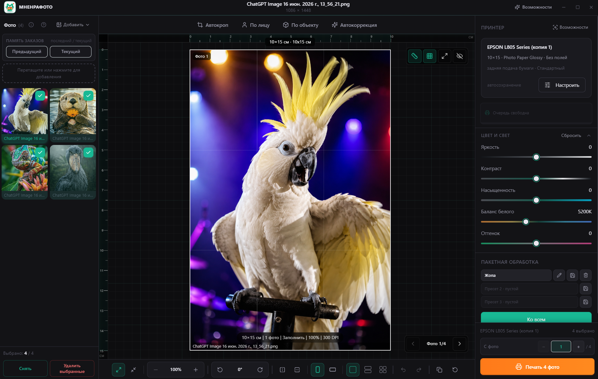

# МНЕНРАФОТО / MNENRAFOTO

Бесплатная Windows-программа для пакетной подготовки, обработки и печати фотографий.

> Текущая версия: **0.1.0 Alpha 1**
> Статус: **публичное тестирование / Pre-release**
> Платформа: **Windows 10/11, 64-bit**

[Сайт RU](https://mnenrafoto.ru/program) · [Website EN](https://mnenrafoto.ru/en/program) · [Boosty](https://boosty.to/mnenra) · [Сообщить об ошибке](https://github.com/mnenracom/mnenrafoto-releases/issues/new/choose)

[English](#english) · [Русский](#русский)

---

## English

**Free Windows app for batch photo preparation and printing.**

**Current interface:** Russian

**English application UI** is planned for Alpha 2.

## About

MNENRAFOTO helps you import, adjust, and print photos on Windows. All image processing runs locally on your computer — photos are not uploaded to the internet.

### Main features

- import files and folders;
- JPG / JPEG / PNG / WebP / HEIC / HEIF;
- batch processing;
- per-photo corrections;
- brightness, contrast, saturation, white balance, tint;
- crop, zoom, pan;
- rotate, straighten, flip;
- layouts 1 / 2 / 4;
- custom presets;
- apply settings to all photos;
- Undo / Redo;
- current and previous order memory;
- print from selected photo or sheet;
- local processing without cloud upload.

### System requirements

- Windows 10/11 x64;
- Windows 10 — final physical verification still pending;
- installed printer driver;
- PowerShell 5.1;
- HEIC may require Windows HEIF/HEVC system extensions;
- minimum 4 GB RAM.

### Physically tested by the developer

- **Epson L805** — 10×15 and A4, layouts 1/2/4;
- **Epson L1250** — 10×15, layouts 1/2/4.

Other Epson models and third-party printers are not claimed as fully supported in this Alpha.

### Installation

1. Download the official Setup EXE from [Releases](https://github.com/mnenracom/mnenrafoto-releases/releases/tag/v0.1.0-alpha.1).
2. Run `MnenraFoto-0.1.0-alpha.1-win-x64-setup.exe`.
3. If SmartScreen warns about an unsigned Alpha build, choose **More info → Run anyway**.
4. Use only official release files. Do not use repacked or modified installers.

### Portable

- Portable EXE does not require Setup installation.
- User settings (presets, order memory, onboarding, etc.) are still stored in Windows userData.
- Setup and Portable share local settings on the same PC.

### HEIC

- HEIC/HEIF is decoded **locally** on your computer.
- Uses the **Windows system decoder** (HEIF Image Extensions and typically HEVC Video Extensions).
- If extensions are missing, the app shows a clear message with guidance.
- Photos are **not sent** to a server or cloud for conversion.

### Alpha limitations

- Test version 0.1.0-alpha.1 — errors are possible.
- Try a test print of one sheet before bulk printing.
- Installer is not code-signed.
- Limited number of physically tested printer models.

### Trademarks

Epson and printer model names are trademarks of their respective owners. MNENRAFOTO is an independent product and is not affiliated with Epson.

### Bug reports

Use [GitHub Issues](https://github.com/mnenracom/mnenrafoto-releases/issues/new/choose) in this repository. Do not attach other people's personal photos.

### Support development / Поддержать разработку

The app remains **free**. Optional support on [Boosty](https://boosty.to/mnenra) helps test additional printer models and fund compatibility work, new formats, and development.

Support does **not** guarantee that a specific printer or feature will be added.

---

## Русский

**Бесплатная программа для пакетной подготовки и печати фотографий на Windows.**

**Текущий интерфейс:** русский

**Английский интерфейс приложения** планируется в Alpha 2.

---

## О программе

МНЕНРАФОТО помогает импортировать, обрабатывать и печатать фотографии на Windows. Вся обработка выполняется локально — фотографии не загружаются в интернет.

### Основные возможности

- импорт файлов и папок;
- JPG / JPEG / PNG / WebP / HEIC / HEIF;
- пакетная обработка;
- коррекция отдельных фотографий;
- яркость, контраст, насыщенность, баланс белого, оттенок;
- кадрирование, масштабирование и панорамирование;
- поворот, выравнивание и отражение;
- раскладки 1 / 2 / 4;
- пользовательские пресеты;
- применение настроек ко всем фотографиям;
- Undo / Redo;
- память текущего и предыдущего заказа;
- печать с выбранной фотографии или листа;
- локальная обработка без загрузки в облако.

### Системные требования

- Windows 10/11 x64;
- Windows 10 — финальная физическая проверка ещё не завершена;
- установленный драйвер принтера;
- PowerShell 5.1;
- для HEIC могут потребоваться системные расширения HEIF/HEVC Windows;
- минимум 4 GB RAM.

### Физически проверено разработчиком

- **Epson L805** — 10×15 и A4, раскладки 1/2/4;
- **Epson L1250** — 10×15, раскладки 1/2/4.

Другие модели Epson и сторонние принтеры в этой Alpha не заявляются как полностью поддерживаемые.

### Установка

1. Скачайте официальный Setup EXE из [Releases](https://github.com/mnenracom/mnenrafoto-releases/releases/tag/v0.1.0-alpha.1).
2. Запустите `MnenraFoto-0.1.0-alpha.1-win-x64-setup.exe`.
3. При предупреждении SmartScreen для неподписанной Alpha выберите **Подробнее → Выполнить в любом случае**.
4. Используйте только официальные файлы релиза.

### Portable

- Portable EXE не требует установки через Setup.
- Пользовательские настройки сохраняются в Windows userData.
- Setup и Portable используют общие локальные настройки на одном компьютере.

### HEIC

- HEIC/HEIF декодируется **локально** на компьютере пользователя.
- Используется **системный декодер Windows**.
- При отсутствии расширений программа покажет понятное сообщение.
- Фотографии **не отправляются** на сервер.

### Ограничения Alpha

- Тестовая версия 0.1.0-alpha.1 — возможны ошибки.
- Перед массовой печатью рекомендуется пробная печать одного листа.
- Установщик не подписан цифровым сертификатом.
- Ограниченное число физически проверенных принтеров.

### Товарные знаки

Epson и названия моделей принтеров являются товарными знаками их правообладателей. МНЕНРАФОТО является независимым программным продуктом и не аффилировано с Epson.

### Обратная связь

Используйте [GitHub Issues](https://github.com/mnenracom/mnenrafoto-releases/issues/new/choose). Не прикладывайте чужие персональные фотографии.

### Support development / Поддержать разработку

Программа остаётся **бесплатной**. Добровольная поддержка на [Boosty](https://boosty.to/mnenra) помогает тестировать дополнительные модели принтеров и развивать совместимость, форматы и функциональность.

Поддержка **не гарантирует** добавление конкретного принтера или функции.

---

## Documents / Документы

- [CHANGELOG.md](CHANGELOG.md)
- [KNOWN_ISSUES.md](KNOWN_ISSUES.md)
- [PRIVACY.md](PRIVACY.md)
- [LICENSE.txt](LICENSE.txt)
- [THIRD_PARTY_NOTICES.txt](THIRD_PARTY_NOTICES.txt)
